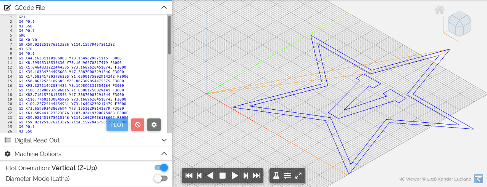

# svg2gcode

[](https://github.com/sameer/svg2gcode/actions/workflows/lib.yml)

[](https://github.com/sameer/svg2gcode/actions/workflows/cli.yml)

[](https://github.com/sameer/svg2gcode/actions/workflows/web.yml)
[](https://github.com/sameer/svg2gcode/actions/workflows/web-deploy.yml)

[](https://codecov.io/gh/sameer/svg2gcode)

Convert vector graphics to g-code for pen plotters, laser engravers, and other CNC machines

## Usage

### Web interface

The `web` workspace is now a React + Vite studio that runs the Rust CAM engine in the browser
through WebAssembly. It lets you:

- drag in a single SVG job
- assign selected SVG elements to different engraving operations
- change per-operation depths and regenerate immediately
- inspect the resulting `.nc` output in an integrated Three.js viewer

For local development:

```sh
cd web
npm install
npm run dev
```

For a production build:

```sh
cd web
npm run build
```

For Docker:

```sh
docker build -t svg2gcode-studio .
docker run --rm -p 8080:8080 svg2gcode-studio
```

Then open `http://localhost:8080`.

For Docker-based frontend development with hot reload:

```sh
docker compose --profile dev up --build frontend
```

Then open `http://localhost:5173`.

The dev container mounts the repo into Vite, keeps `node_modules` and the WASM build cache in
named volumes, and uses polling so file changes under `/Volumes/...` are picked up reliably.

### Command line interface (CLI)

#### Install

```sh
cargo install svg2gcode-cli
```

#### Usage
```
Arguments:
  [FILE]
          A file path to an SVG, else reads from stdin

Options:
      --tolerance <TOLERANCE>
          Curve interpolation tolerance (mm)

      --feedrate <FEEDRATE>
          Machine feed rate (mm/min)

      --dpi <DPI>
          Dots per Inch (DPI) Used for scaling visual units (pixels, points, picas, etc.)

      --travel-z <TRAVEL_Z>
          Absolute safe travel height on the Z axis (mm)

      --cut-z <CUT_Z>
          Absolute cutting depth on the Z axis (mm)

      --plunge-feedrate <PLUNGE_FEEDRATE>
          Feedrate for plunging from travel_z to cut_z (mm/min)

      --on <TOOL_ON_SEQUENCE>
          G-Code for turning on the tool

      --path-begin <PATH_BEGIN_SEQUENCE>
          G-Code for inserting at the beginning of each SVG path/stroke

      --off <TOOL_OFF_SEQUENCE>
          G-Code for turning off the tool

      --begin <BEGIN_SEQUENCE>
          G-Code for initializing the machine at the beginning of the program

      --end <END_SEQUENCE>
          G-Code for stopping/idling the machine at the end of the program

  -o, --out <OUT>
          Output file path (overwrites old files), else writes to stdout

      --settings <SETTINGS>
          Provide settings from a JSON file. Overrides command-line arguments

      --export <EXPORT>
          Export current settings to a JSON file instead of converting.
          
          Use `-` to export to standard out.

      --origin <ORIGIN>
          Coordinates for the bottom left corner of the machine

      --dimensions <DIMENSIONS>
          Override the width and height of the SVG (i.e. 210mm,297mm)
          
          Useful when the SVG does not specify these (see https://github.com/sameer/svg2gcode/pull/16)
          
          Passing "210mm," or ",297mm" calculates the missing dimension to conform to the viewBox aspect ratio.

      --circular-interpolation <CIRCULAR_INTERPOLATION>
          Whether to use circular arcs when generating g-code
          
          Please check if your machine supports G2/G3 commands before enabling this.
          
          [possible values: true, false]

      --line-numbers <LINE_NUMBERS>
          Include line numbers at the beginning of each line
          
          Useful for debugging/streaming g-code
          
          [possible values: true, false]

      --checksums <CHECKSUMS>
          Include checksums at the end of each line
          
          Useful for streaming g-code
          
          [possible values: true, false]

      --newline-before-comment <NEWLINE_BEFORE_COMMENT>
          Add a newline character before each comment
          
          Workaround for parsers that don't accept comments on the same line
          
          [possible values: true, false]

  -h, --help
          Print help (see a summary with '-h')

  -V, --version
          Print version
```

#### Example

```sh
svg2gcode-cli examples/Vanderbilt_Commodores_logo.svg --off 'M4' --on 'M5' -o out.gcode
```

#### Compass-style output

If you want output closer to the Autodesk Compass post, you can now inject a sequence at the
start of every SVG stroke/path. That is useful for per-feature commands such as `M800`.

There is a starter preset at [`examples/compass_settings.json`](examples/compass_settings.json).
For example:

```sh
svg2gcode-cli examples/Vanderbilt_Commodores_logo.svg \
  --settings examples/compass_settings.json \
  -o out.nc
```

This gets the output closer to Compass conventions by:

- retracting to a configurable travel Z before rapids
- plunging to a configurable cut Z at a separate plunge feed
- forcing `G17` at program start
- inserting `M800` at each path start
- using fixed spindle start/stop snippets
- ending with `G28` and `M30`

This project now supports simple absolute Z motion for SVG strokes, but it still does not model
full CAM concepts such as tool libraries, operation-specific depths, tabs, lead-ins, or adaptive
toolpaths, so it is not yet a full replacement for the Fusion post.

#### Engraving CAM mode

There is now a first DMA-oriented engraving workflow for SVG artwork.

In engraving mode the converter can:

- preserve the SVG's authored size by default, or infer height from `--svg-width`
- use a bottom-left stock origin with `placement_x` / `placement_y`
- engrave SVG strokes as centerline cuts
- pocket filled SVG regions with inward offset contours
- cut to a constant target depth using automatic multi-pass stepdown
- emit DMA-safe `G0` / `G1` programs only
- warn when toolpaths exceed the configured stock or machine envelope

CLI flags for this mode include:

- `--engrave`
- `--material-width`
- `--material-height`
- `--material-thickness`
- `--tool-diameter`
- `--tool-shape`
- `--target-depth`
- `--max-stepdown`
- `--cut-feedrate`
- `--plunge-feedrate`
- `--stepover`
- `--svg-width`
- `--placement-x`
- `--placement-y`

The bundled Compass preset now includes engraving settings for a flat end mill and DMA-style
travel/plunge behavior.


To convert curves to G02/G03 Gcode commands, use flag `--circular-interpolation true`.


#### Output, rendered at [https://ncviewer.com](https://ncviewer.com)

```sh
cat out.gcode
```



### Library

The core functionality of this tool is available as the [svg2gcode crate](https://crates.io/crates/svg2gcode).

## Blog Posts

These go into greater detail on the tool's origins, implementation details, and planned features.

- https://purisa.me/blog/pen-plotter/
- https://purisa.me/blog/svg2gcode-progress/

## FAQ / Interesting details

- Use a 3D printer for plotting: (thanks [@jeevank](https://github.com/jeevank) for sharing this) https://medium.com/@urish/how-to-turn-your-3d-printer-into-a-plotter-in-one-hour-d6fe14559f1a

- Convert a PDF to GCode: follow [this guide using Inkscape to convert a PDF to an SVG](https://en.wikipedia.org/wiki/Wikipedia:Graphics_Lab/Resources/PDF_conversion_to_SVG#Conversion_with_Inkscape), then use it with svg2gcode

- Are shapes and fills supported? Yes in engraving CAM mode for constant-depth pocketing. Outside engraving mode, standard conversion still traces SVG strokes/paths rather than machining filled areas.
- Are stroke patterns supported? No, but you can convert them into paths in Inkscape with `Stroke to Path`.

## Reference Documents

- [W3 SVG2 Specification](https://www.w3.org/TR/SVG/Overview.html)
- [CSS absolute lengths](https://www.w3.org/TR/css-values/#absolute-lengths)
- [CSS font-relative lengths](https://www.w3.org/TR/css-values/#font-relative-lengths)
- [CSS compatible units](https://www.w3.org/TR/css-values/#compat)
- [RepRap G-code](https://reprap.org/wiki/G-code)
- [G-Code and M-Code Reference List for Milling](https://www.cnccookbook.com/g-code-m-code-reference-list-cnc-mills/)
